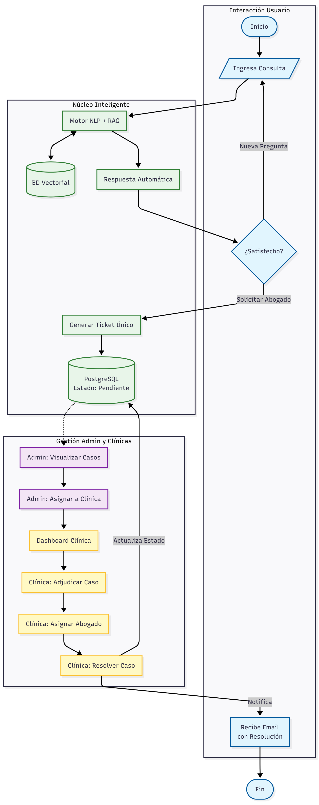

# ⚖ LegalTech: Asistente legal inteligente y sistema de gestión (SaaS)

> *Plataforma de democratización del acceso a la justicia mediante inteligencia artificial y gestión de casos para clínicas jurídicas.*

## 📖 Descripción general
LegalTech es una solución de software diseñada para cerrar la brecha de acceso a la información jurídica en Chile. El sistema funciona mediante un *modelo híbrido de atención*:
1.  *Nivel 1 (Automatizado):* Un chatbot impulsado por *NLP (procesamiento de lenguaje natural)* y una base de datos vectorial que responde consultas sobre legislación chilena (Familia, Laboral, Penal) utilizando fuentes oficiales como la Biblioteca del Congreso Nacional.
2.  *Nivel 2 (Humano):* Un sistema de *ticketing y derivación* que permite escalar casos complejos a abogados reales de clínicas jurídicas universitarias.

## 🧩 Diagrama de arquitectura del sistema

> **Diagrama de arquitectura:**
>
> 
>

## 🚀 Características principales

* *Chatbot Jurídico con IA:* Integración de modelos de lenguaje y búsqueda vectorial para interpretar consultas en lenguaje natural y entregar respuestas basadas en la ley vigente.
* *Sistema de tickets inteligente:* Si la IA no puede resolver la duda, o si el usuario requiere representación, se genera un ticket único que se asigna a una institución legal asociada.
* *Arquitectura de Datos Híbrida:*
    * *PostgreSQL (Relacional):* Para la integridad de usuarios, roles, tickets y asignación de casos.
    * *MongoDB (NoSQL):* Para almacenar logs de conversaciones no estructuradas y entrenar futuras mejoras del modelo.
* *🔐 Seguridad:* Encriptación de datos sensibles y comunicación vía HTTPS para proteger la privacidad de los consultantes.
* *🎓 Módulo de gestión (Admin):* Panel para que las clínicas jurídicas administren, acepten y den seguimiento a los casos derivados.

## 🛠 Stack tecnológico

El proyecto fue construido utilizando una arquitectura modular para asegurar escalabilidad:

* *Backend y AI:* Python (Procesamiento de datos legales), Node.js (API REST).
* *Base de Datos:* PostgreSQL (Gestión relacional), MongoDB (Documental/Logs), Base de datos vectorial (para búsquedas semánticas).
* *Frontend:* JavaScript / React (Interfaz de usuario responsiva Web/Móvil).
* *Infraestructura:* Diseño escalable para soporte de alta concurrencia.

## 🧩 Arquitectura del Sistema

El flujo de información sigue el patrón "Human-in-the-loop":

1.  *Input:* El usuario realiza una pregunta ("¿Qué hago si me despidieron sin aviso?").
2.  *Processing:* El motor de NLP analiza la intención y busca vectores similares en la base de datos legislativa.
3.  *Output A (Respuesta automática):* El sistema entrega la ley asociada y una explicación simplificada.
4.  *Output B (Derivación):* El usuario solicita ayuda personalizada -> Se crea un Ticket en PostgreSQL -> Se notifica al panel de la clínica jurídica.

## 🌟 Impacto y Resultados
Este proyecto fue desarrollado por los estudiantes:
 * Fernanda Lorca
 * Catalina Lorca
 * Felipe Lazo
 * Jazmín Cuitiño
 * Gonzalo Troncoso

de la Universidad Diego Portales, simulando un entorno real de consultoría tecnológica.

* *Social:* Facilita el entendimiento de derechos y obligaciones a ciudadanos sin conocimientos técnicos.
* *Técnico:* Implementación exitosa de un sistema capaz de manejar datos estructurados (SQL) y no estructurados (NoSQL) simultáneamente.

---
Desarrollado como proyecto semestral para la carrera de Ingeniería Civil en Informática y Telecomunicaciones.